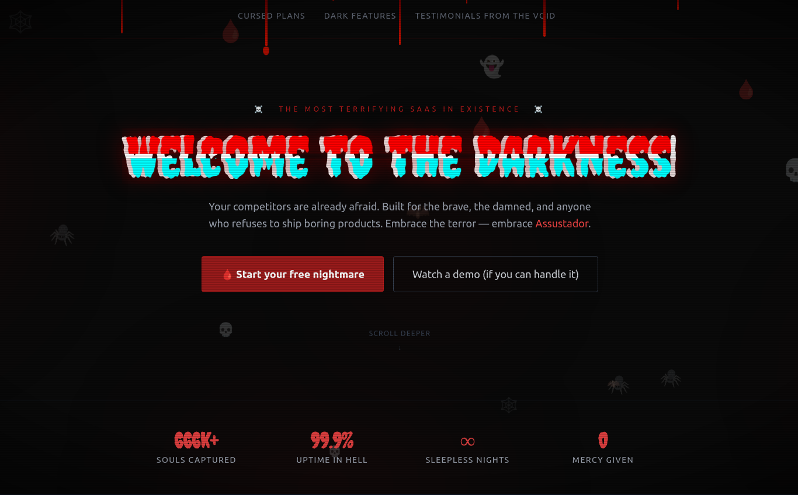
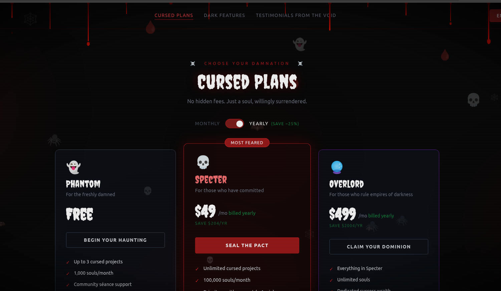
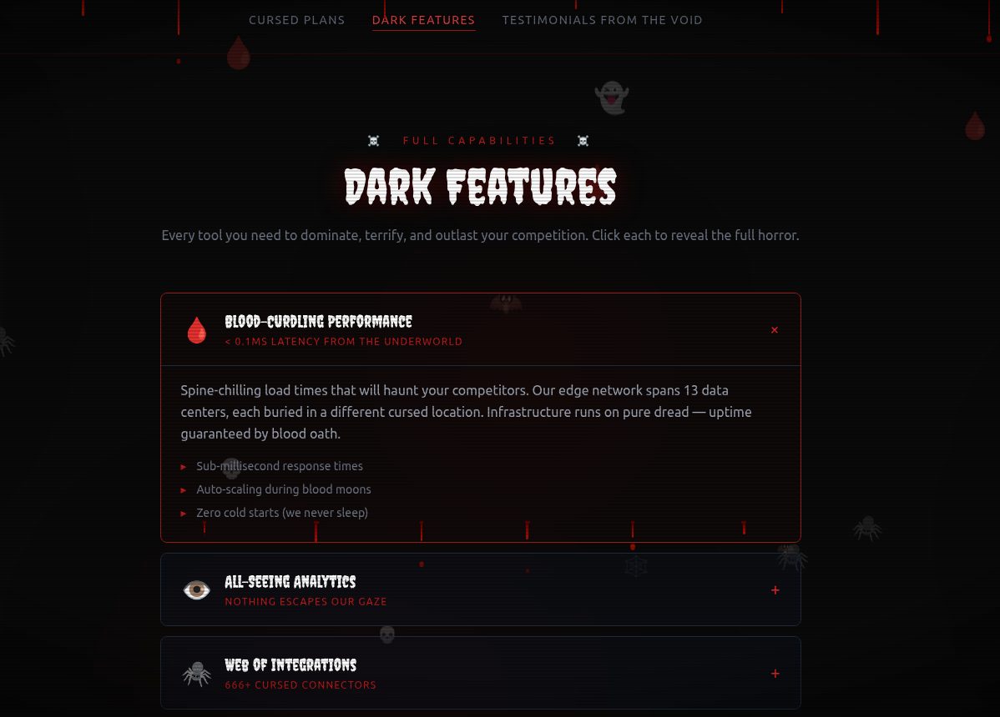
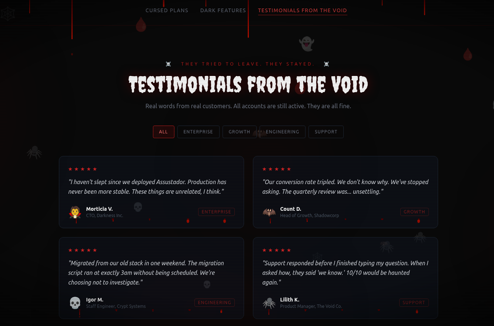

# 💀 Assustador

> O SaaS mais aterrorizante da existência.



---

## 📸 Screenshots

| Home | Planos Malditos | Funcionalidades Sombrias | Depoimentos do Vazio | 
|------|-----------------|-----------------|----------------------|
|  |  |  |   |

---

## 🩸 Sobre o projeto

**Assustador** é uma landing page temática de terror construída com React + Vite + Tailwind CSS. O projeto foi criado como vitrine de uma plataforma SaaS fictícia voltada para os "corajosos, os malditos e qualquer um que se recuse a lançar produtos entediantes."

Inclui efeitos visuais de horror como:
- Pingos de sangue animados caindo do topo da tela
- Pingos de sangue nas bordas dos cards
- Efeito glitch no título principal
- Scanlines e vinheta estilo CRT
- Partículas flutuantes (caveiras, morcegos, aranhas)
- Pools de sangue desfocados no fundo
- Cursor personalizado vermelho

---

## 🛠️ Stack

| Tecnologia | Versão |
|------------|--------|
| [React](https://react.dev/) | 18 |
| [Vite](https://vitejs.dev/) | 6 |
| [Tailwind CSS](https://tailwindcss.com/) | 3 |
| [React Router](https://reactrouter.com/) | 7 |
| Node.js | 22 (ver `.nvmrc`) |

---

## 📄 Páginas

| Rota | Descrição |
|------|-----------|
| `/` | Hero principal com efeito typewriter, estatísticas e CTA |
| `/plans` | Planos de preços (Phantom, Specter, Overlord) com toggle mensal/anual |
| `/features` | 9 funcionalidades em accordion expansível |
| `/testimonials` | 8 depoimentos com filtro por categoria |

---

## 🚀 Como rodar localmente

**Pré-requisito:** Node.js 22 (use [nvm](https://github.com/nvm-sh/nvm))

```bash
# Use a versão correta do Node
nvm use

# Instale as dependências
npm install

# Inicie o servidor de desenvolvimento
npm run dev
```

Acesse [http://localhost:5173](http://localhost:5173)

### Outros comandos

```bash
npm run build    # Gera build de produção em /dist
npm run preview  # Visualiza o build localmente
```

---

## 📁 Estrutura do projeto

```
assustador/
├── public/
│   └── favicon.svg
├── src/
│   ├── components/
│   │   ├── Layout.jsx          # Nav + footer + efeitos globais
│   │   ├── BloodDrips.jsx      # Pingos animados no topo da tela
│   │   ├── CardBloodDrips.jsx  # Pingos nos cards
│   │   └── FloatingParticles.jsx
│   ├── pages/
│   │   ├── Home.jsx
│   │   ├── CursedPlans.jsx
│   │   ├── DarkFeatures.jsx
│   │   └── Testimonials.jsx
│   ├── App.jsx                 # Roteamento
│   ├── main.jsx
│   └── index.css               # Tailwind + animações customizadas
├── index.html
├── vite.config.js
├── tailwind.config.js
└── .nvmrc                      # Node 22
```

---

## 🎨 Efeitos visuais

### Animações CSS customizadas (em `tailwind.config.js`)

| Classe | Descrição |
|--------|-----------|
| `animate-flicker` | Pisca com opacidade variável |
| `animate-float` | Flutua para cima e para baixo |
| `animate-fade-in` | Aparece suavemente com slide-up |
| `animate-shake` | Tremor horizontal |

### Classes globais (em `index.css`)

| Classe | Descrição |
|--------|-----------|
| `.glitch` | Efeito glitch com camadas vermelha e ciano |
| `.scanlines` | Linhas de varredura estilo CRT |
| `.vignette` | Escurecimento nas bordas da tela |
| `.blood-drip` | Pingo simples para botões CTA |

---

## 📝 Licença

Todas as almas reservadas. Sem reembolso após possessão.
